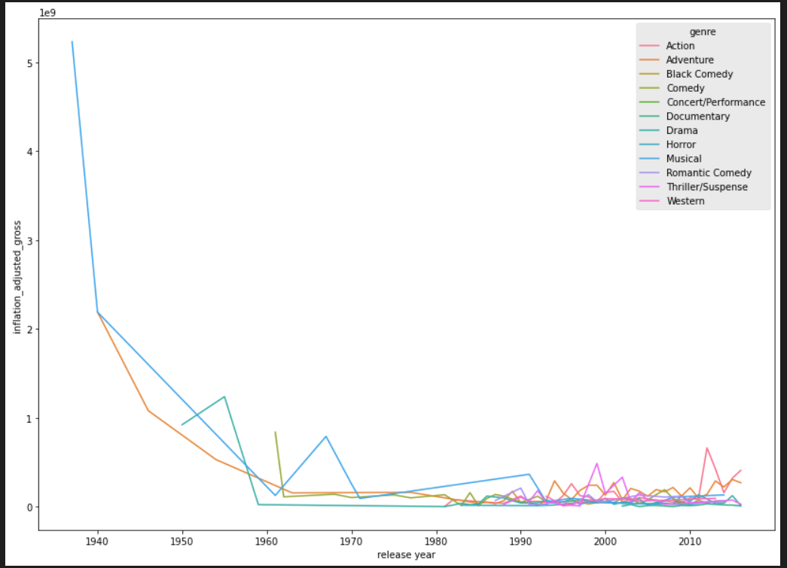

# Analyse_D

## data set du Titanic

### :file_folder: présentation de dataset
<!-- TABLE OF CONTENTS -->

  
Table of Contents

  <ol>
    <li>
      <a href="#about-the-project">About The Project</a>
      <ul>
        <li></a></li>
      </ul>
     </li>
     <li>
      <a href="#getting-started">Loading libraries and data</a>
      <ul> </ul>
    </li>
    <li>
      <a href="#getting-started">Visualize the genre popularity trend</a>
    </li>
    <ul>
        <li></li>
      </ul>
      <ul>
        <li></li>
      </ul>
    <li>
      <a href="#getting-started">Data transformation</a>
    </li>
     <li>
      <a href="#getting-started">Onfidence intervals for regression parameters :n</a>
    </li>
    <ul>
        <li></li>
      </ul>
      <ul>
        <li></li>
      </ul>
    <li>
      <a href="#getting-started">Should Disney make more action and adventure movies?
 </a>
    </li>
    

<!-- ABOUT THE PROJECT -->
## :star2: About The Project
In this notebook, we will explore a dataset of Disney movies and analyze what contributes to the success of Disney movies. The data contains 579 Disney movies with six features: movie title, release date, genre, MPAA rating, total gross, and inflation-adjusted gross.

## :gear: Loading libraries and data

<li> import numpy as np </li>
<li> import matplotlib.pyplot as plt </li>
<li> import seaborn as sns 

## :eyes: Top ten movies at the box office
  Let's started by exploring the data. We will check which are the 10 Disney movies that have earned the most at the box office. We can do this by sorting movies by their inflation-adjusted gross (we will call it adjusted gross from this point onward). 
    

  
## :zap: Visualize the genre popularity trend 
From the top 10 movies above, it seems that some genres are more popular than others.
=> We will make a plot out of these means of groups to better see how box office revenues have changed over time.
=> Action and Adventure are more popular
  

  
## :white_check_mark: Data transformation .
  ==> The line plot supports our belief that some genres are growing faster in popularity than others. For Disney movies, Action and Adventure genres are growing the fastest. Next, we will build a linear regression model to understand the relationship between genre and box office gross
  ==>From the regression model, we can check the effect of each genre by looking at its coefficient given in units of box office gross dollars. We will focus on the impact of action and adventure genres here.
  ===>Note that the intercept and the first coefficient values represent the effect of action and adventure genres respectively.

## Onfidence intervals for regression parameters :
   => 
   .We will calculate the confidence intervals using the pairs bootstrap method.
    .After the initialization, we will perform pair bootstrap estimates for the regression parameters.
    .Finally, we compute 95% confidence intervals for the intercept and coefficient and examine if they exclude 0. If one of them (or both) does, then it is unlikely that the value is 0. 
  ==>We can conclude that there is a significant relationship between that genre and the adjusted gross.

  
  
  
  
## :hammer_and_wrench: Should Disney make more action and adventure movies?
 

  
  From the results of the bootstrap analysis and the trend plot we have done earlier, we could say that Disney movies with plots that fit into the action and adventure genre, according to our data, tend to do better in terms of adjusted gross than other genres. So we could expect more Marvel, Star Wars, and live-action movies in the upcoming years!

